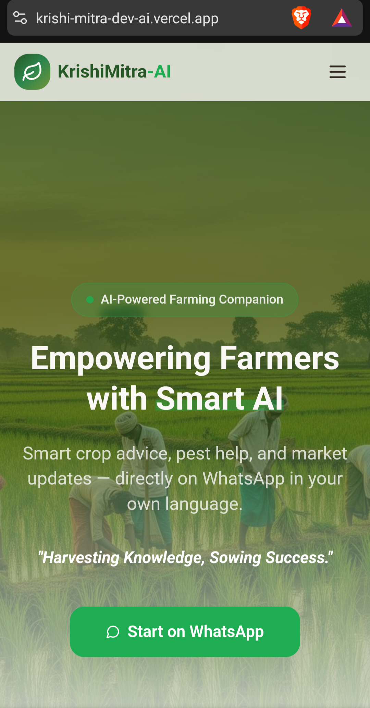
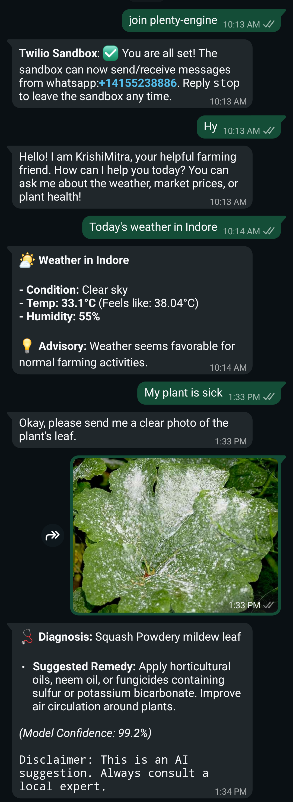
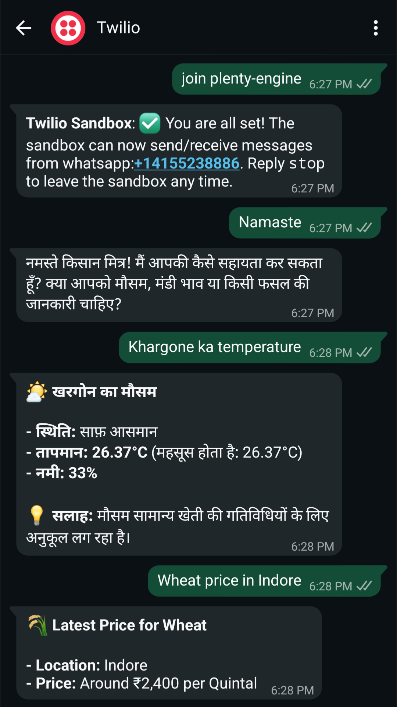

# 🌾 KrishiMitra AI

### Multilingual AI-powered agricultural intelligence system delivered through WhatsApp

KrishiMitra is an AI-assisted agricultural intelligence platform designed to help farmers with:

- crop disease diagnosis
- mandi price assistance
- weather intelligence
- multilingual conversational support

through a WhatsApp-based workflow powered by FastAPI, TensorFlow, Gemini Vision, and Twilio APIs.

---

# 🔗 Live Demo & Deployments

## 🌐 Frontend
https://krishi-mitra-dev-ai.vercel.app/

## 🤗 Backend Deployment
https://shivamr021-krishimitra-ai.hf.space/

## 🎥 Demo Video
https://youtube.com/shorts/ygmrwU6daT0?feature=share

---

# ✨ Core Features

## 🐛 Crop Disease Diagnosis

Implements a confidence-threshold-based hybrid inference workflow:

1. A local TensorFlow/EfficientNet model performs fast disease classification.
2. Low-confidence predictions are routed to Gemini Vision for additional analysis.

This architecture improves robustness while reducing unnecessary API calls.

---

## 📈 Real-Time Mandi Price Assistance

Users can request agricultural market pricing using natural-language WhatsApp queries.

### Example
> "What is the soybean price in Indore?"

---

## 🌤 Weather Intelligence

Provides real-time weather insights including:

- temperature
- humidity
- environmental conditions

to support day-to-day agricultural planning.

---

## 🌐 Multilingual AI Interaction

Supports multilingual conversational responses including:

- Hindi
- English

using Gemini-powered conversational workflows.

---

# ⚙️ Technology Stack

| Component | Technology |
|---|---|
| Backend API | FastAPI |
| ML Framework | TensorFlow / Keras |
| Vision Model | EfficientNetB0 |
| LLM Integration | Google Gemini |
| Messaging Platform | Twilio WhatsApp API |
| Deployment | Hugging Face Spaces |
| Frontend Hosting | Vercel |
| Containerization | Docker |

---

# 🏗 System Architecture

KrishiMitra routes user requests through specialized processing pipelines:

- Disease Detection Pipeline
- Market Price Handler
- Weather Intelligence Handler
- Conversational AI Handler

The disease diagnosis workflow combines:

- local CNN inference
- confidence-threshold routing
- Gemini Vision fallback analysis

to improve handling of uncertain or low-quality agricultural images.

Detailed system design notes are available in:

```text
docs/ARCHITECTURE.md
```

---

# 📊 Model Evaluation

The disease classification pipeline was trained using transfer learning on PlantDoc-style agricultural datasets.

Evaluation artifacts and observations are available in:

```text
docs/EVALUATION.md
docs/EVALUATION_RESULTS.md
evaluation/eval.py
```

## Key Observations

- controlled datasets generalized poorly to real-world farmer images
- compressed WhatsApp images remain challenging
- low-light agricultural images reduced prediction reliability
- fallback routing improved uncertain prediction handling

---

# 🖼 Screenshots

## Frontend Demo



---

## WhatsApp Workflow



---

## Hindi Interaction Demo



---

# 🚀 Local Setup

## Clone Repository

```bash
git clone https://github.com/shivamr021/KrishiMitra-AI.git

cd KrishiMitra-AI
```

---

## Install Dependencies

```bash
pip install -r requirements.txt
```

---

## Configure Environment Variables

Create a `.env` file:

```env
GEMINI_API_KEY=
TWILIO_ACCOUNT_SID=
TWILIO_AUTH_TOKEN=
WEATHER_API_KEY=
```

---

## Run Backend Server

```bash
uvicorn main:app --reload
```

---

# 💬 Example Interaction

## User
> मक्का में कौनसी बीमारी है?

## Bot
> आपकी फसल में फंगल संक्रमण के संकेत दिखाई दे रहे हैं। कृपया कॉपर-आधारित फफूंदनाशी का उपयोग करें।

---

# 📁 Repository Structure

```text
backend/
frontend/
docs/
evaluation/
assets/
```

---

# 👥 Team

## Shivam Rathod
Backend Development, AI Integration, TensorFlow Model Training, Twilio Workflow Automation

## Sahil Kukreja
Frontend Development

## Shatakshi Tiwari
Presentation & Research Support

## Nitika Jain
Documentation & Research Support

---

# 📌 Project Context

This project was initially developed during the OpenAI × NxtWave Buildathon and later refined into an applied AI systems engineering portfolio project.

---

# 📄 License

MIT License
